# Workshop 03: Construindo chatbots com Dialogflow CX e Twilio

Bem vindo ao workshop "Construindo chatbots com [Dialogflow CX](https://cloud.google.com/dialogflow) e [Twilio](https://www.twilio.com).

Instrutores: [Luna Logo](https://www.linkedin.com/in/viclongo/) e [Luis Leão](https://www.linkedin.com/in/luisleao/).

## Introdução

Este guia mostra como usar o Console do Dialogflow CX para criar e testar um agente simples de pedidos de camisetas. Ao interagir com esse agente, é possível ver a localização da loja, o horário de funcionamento ou fazer um pedido de camiseta.

Ao concluir o agente deste guia, o console o representará graficamente da seguinte maneira:

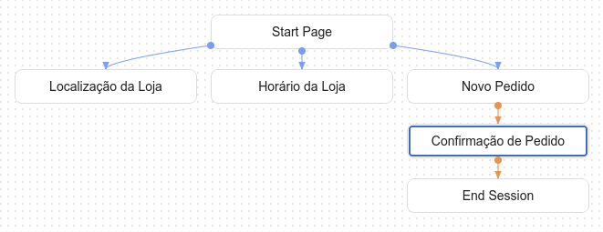

## Criar um agente

Crie um novo agente para este guia:

1. Abra o [Console do Dialogflow CX](https://dialogflow.cloud.google.com/cx/projects?hl=pt-br).
2. Crie ou escolha um projeto do GCP.
3. Clique em **Criar agente**.
4. Preencha o formulário para as configurações básicas do agente.
    1. Você pode escolher qualquer nome de exibição.
    2. Selecione **us-central1** como localidade (Location)
    3. Selecione o fuso horário (Timezone).
    4. Selecione o idioma (Default language) do agente (pt-br).
5. Você deve ver a sua janela mais ou menos assim:

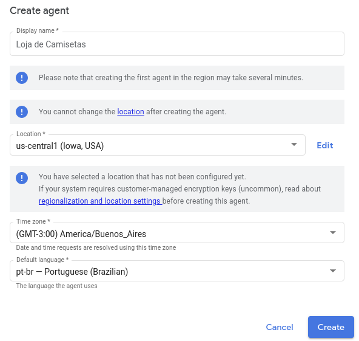

6. Clique em **Create**.

## Fluxo e intents padrões

O fluxo e as intents a seguir são criados automaticamente para um novo agente. Para encontrar as intents, clique em **Manage** e em **Intents**: 

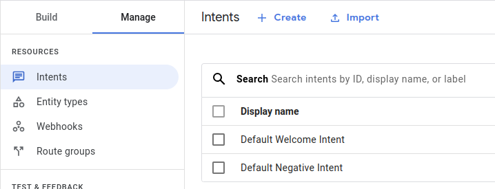

Para encontrar o fluxo, clique em **Build**:

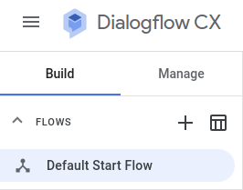

<table>
  <tr>
   <td><strong>Default welcome intent</strong>
   </td>
   <td>A <a href="https://cloud.google.com/dialogflow/cx/docs/concept/intent?hl=pt-br#welcome">intent de boas-vindas padrão</a> tem frases de treinamento simples, como "Oi", ou "Olá", que correspondem à entrada inicial do usuário. É possível editar essa intent como quiser.
   </td>
  </tr>
  <tr>
   <td><strong>Default negative intent</strong>
   </td>
   <td>A <a href="https://cloud.google.com/dialogflow/cx/docs/concept/intent?hl=pt-br#negative">intent negativa padrão</a> pode ser usada para adicionar frases de treinamento ao intent que atuam como exemplos negativos.
   </td>
  </tr>
  <tr>
   <td><strong>Default start flow</strong>
   </td>
   <td>O <a href="https://cloud.google.com/dialogflow/cx/docs/concept/flow?hl=pt-br#start">fluxo inicial padrão</a> pode ser usado como um fluxo único. É o fluxo que será usado neste guia. Para agentes mais complexos, é possível adicionar mais fluxos. Esse fluxo tem uma <a href="https://cloud.google.com/dialogflow/cx/docs/concept/handler?hl=pt-br#route">rota de intent</a> padrão com o Intent de boas-vindas padrão como um requisito de intent.
   </td>
  </tr>
</table>

### Testar a mensagem de resposta de boas-vindas padrão

O fluxo e as intents padrão podem realizar uma conversa básica com apenas uma mensagem de boas-vindas. Para testar o novo agente:

1. Clique no botão **Test agent ** (testar agente) para abrir o simulador.
2. Digite `oi` na entrada de texto e pressione "Enter".
3. O agente responde com uma resposta de boas-vindas padrão.
4. Feche o simulador.

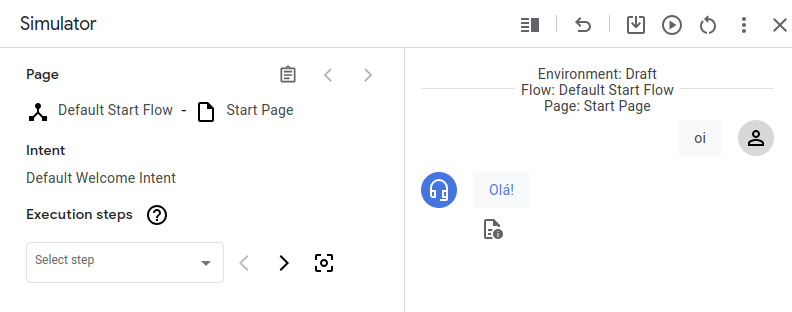

As seguintes etapas foram realizadas pelo agente para essa entrada do usuário final:

1. Quando você forneceu a entrada, o [Default start flow](https://cloud.google.com/dialogflow/cx/docs/concept/flow?hl=pt-br#start) era o fluxo ativo e a [start page](https://cloud.google.com/dialogflow/cx/docs/concept/flow?hl=pt-br#start-page) era a página ativa. Cada um dos manipuladores de estado aplicados ao fluxo ativo estava [no escopo](https://cloud.google.com/dialogflow/cx/docs/concept/handler?hl=pt-br#scope), portanto, o agente os avaliou.
2. Uma das rotas avaliadas tem a **Default welcome intent** como um requisito de intent. A entrada correspondeu a essa intent. Portanto, a rota foi chamada.
3. A rota chamada tem várias mensagens de resposta de conclusão. O agente escolheu uma delas aleatoriamente e a adicionou à [fila de respostas](https://cloud.google.com/dialogflow/cx/docs/concept/fulfillment?hl=pt-br#queue).
4. A rota chamada não tem destino de transição. Portanto, o fluxo e a página ativos não foram alterados.
5. O agente respondeu com o conteúdo da fila de respostas.

### Editar a mensagem de resposta de boas-vindas

É possível mudar a mensagem de boas-vindas. Para editar a mensagem de resposta de boas-vindas:

1. Clique na guia **Build**.
2. Selecione o **Default start flow** na seção **Flows**.
3. Clique no nó **Start page** no gráfico. Esta é a página inicial do **Default start flow**.
4. Encontre a rota de intent com a **Default welcome intent** como um requisito de intent e clique nela. Isso abre um painel para editar as informações do trajeto de intent.

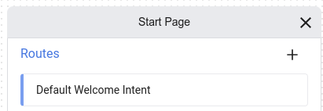

5. Encontre a seção de fulfillment, exclua todas as mensagens de resposta e adicione `Olá, eu sou um agente virtual que ajuda com compra de camisetas. Como posso lhe ajudar?` como a única resposta.

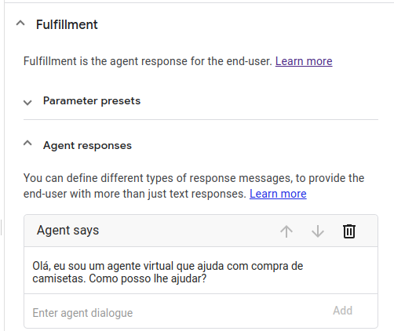

6. Clique em **Save**.
7. Feche o painel de edição da rota de intent.

### Testar a mensagem de resposta de boas-vindas atualizada

Para testar a resposta atualizada:

1. Clique no botão **Testar agente** para abrir o simulador.
2. Digite `Oi` na entrada de texto e pressione "Enter".
3. O agente responde com a nova mensagem.
4. Feche o simulador.

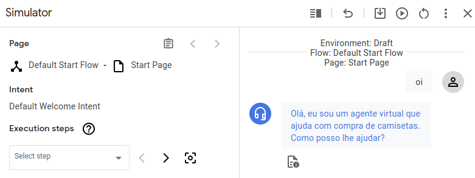

## Página "Localização da loja"

Uma conversa do Dialogflow CX pode ser descrita e visualizada como uma [máquina de estado](https://en.wikipedia.org/wiki/Finite-state_machine). Os estados de uma sessão do CX são representados por [pages (páginas)](https://cloud.google.com/dialogflow/cx/docs/concept/page?hl=pt-br). Até agora, você tem apenas uma página, então o agente não é muito útil. Nesta seção, você criará outra página que processa perguntas sobre o local da loja.

### Criar a intent de localização

Uma [intent](https://cloud.google.com/dialogflow/cx/docs/concept/intent?hl=pt-br) categoriza a intenção do usuário final em uma conversa. Para criar um intent que é correspondido quando a entrada do usuário final solicita o local da loja:

1. Selecione a guia **Manage**.
2. Clique em **Intents**.
3. Clique em **Create**.
4. Insira `loja.localização` para o nome de exibição da intent.
5. Ative a opção **Skip auto innovation**.
6. Digite as seguintes frases de treinamento:
    * `Onde fica a loja?`
    * `Diga-me o endereço`
    * `Onde retiro a minha encomenda?`
    * `Como eu chego lá?`
    * `Em que rua você está?`
    * `Qual é o seu endereço?`
    * `Como faço para chegar na sua loja?`
    * `Onde você está localizado?`
7. Clique em **Save**.

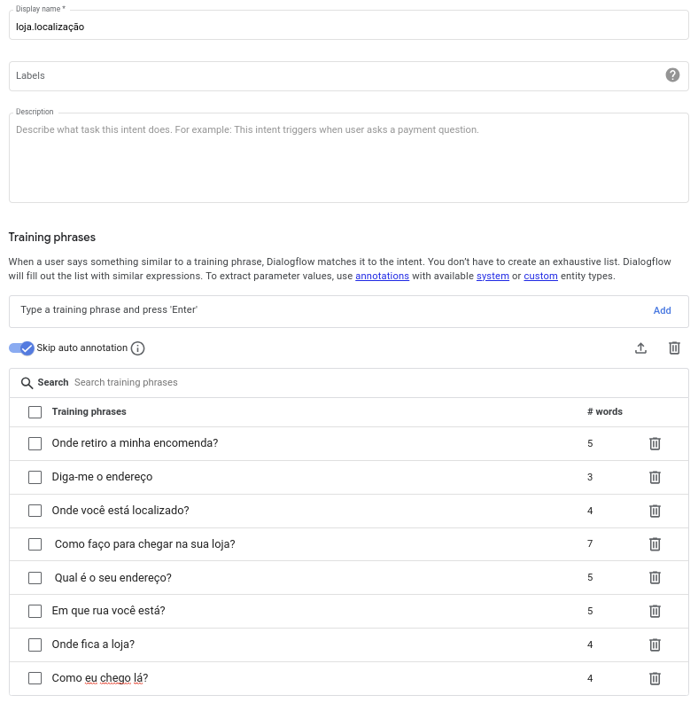

### Criar a página de localização da loja

Agora, criaremos uma nova **page** (página). Adicione um _fulfillment de entrada_ à página que será chamada sempre que a página se torne ativa. Esse preenchimento de entrada deve ter uma mensagem de resposta que forneça a localização da loja. Para criar a página do local da loja:

1. Clique na guia **Build**.
2. Selecione o **Default start flow** na seção **Flow**.
3. Clique no botão de adição + na seção **Pages**. Uma entrada de texto para o nome de exibição da página aparece.
4. Insira `Localização da Loja` como o nome de exibição da página e pressione Enter.
5. Clique no botão de opções (três pontos verticais ao lado do nome) ao lado do nome de exibição da página.
6. Selecione **Edit** para abrir o painel de edição de página.
7. Encontre o **Entry fulfillment** e clique em **Edit fulfillment**.
8. Digite `A nossa loja está localizada na Avenida Brigadeiro Faria Lima, número 3477, São Paulo.` no campo **Agent says** (fala do agente). 
9. Clique em **Save**.
10. Feche o painel de edição da página.

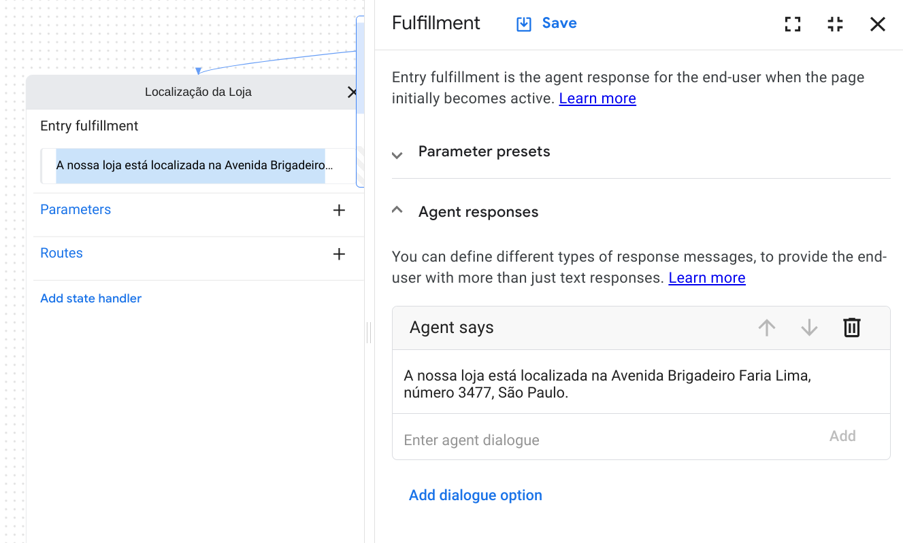

### Adicionar uma rota de intent de localização ao fluxo

Agora você precisa criar uma rota que tenha a página do local da loja como um destino de transição. Quando essa rota é chamada, a sessão faz a transição para a página do local da loja. Essa rota é aplicada ao **Default start flow**. Portanto, está no escopo, desde que o fluxo esteja ativo. Para um agente de fluxo único, isso significa que a rota está sempre no escopo. A qualquer momento da conversa, o usuário final pode solicitar a localização da loja, e essa rota será chamada.

Para criar essa rota:

1. Clique na guia **Build**.
2. Selecione o **Default start flow** na seção **Flows**.
3. Clique no nó **Start page** no gráfico. Esta é a página inicial do **Default start flow**.
4. Clique no **+ **ao lado de **Route** e adicione a seguinte rota de intent:
    * **Intent**: `loja.localização`
    * **Transition:** `Localização da loja`
5. Clique em **Save**.
6. Feche o painel de edição da rota de intent.

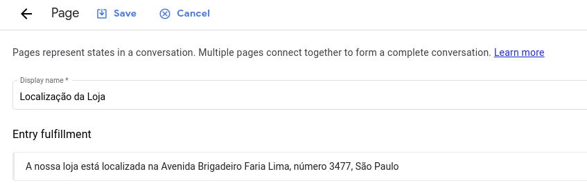

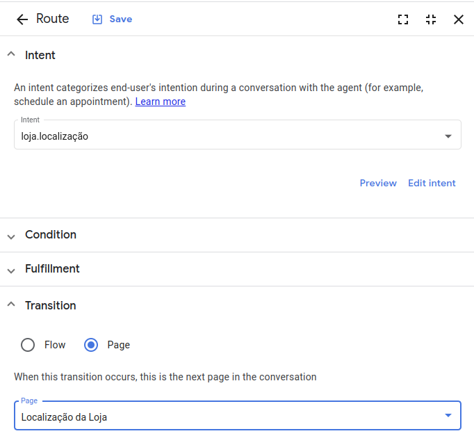

### Testar a página do local da loja

Para testar a página do local da loja, faça o seguinte:

1. Clique no botão **Test agent** para abrir o simulador.
2. Digite `Qual é a localização da loja?` e pressione "Enter".
3. O agente fornece o endereço

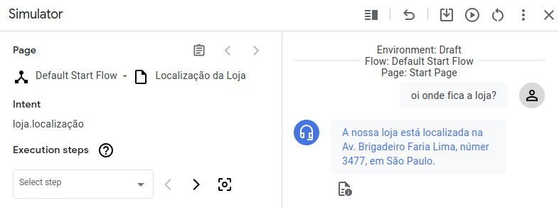

4. Feche o simulador.

As etapas a seguir foram tomadas pelo agente para corresponder à entrada do usuário final:

1. Quando você forneceu a entrada, o [Default start flow](https://cloud.google.com/dialogflow/cx/docs/concept/flow?hl=pt-br#start) era o fluxo ativo e a [Default start page](https://cloud.google.com/dialogflow/cx/docs/concept/flow?hl=pt-br#start-page) era a página ativa. Cada um dos manipuladores de estado aplicados ao fluxo ativo estava [no escopo](https://cloud.google.com/dialogflow/cx/docs/concept/handler?hl=pt-br#scope), portanto, o agente os avaliou.
2. Uma das rotas avaliadas tem **loja.localização** como um requisito de intent. A entrada correspondeu a essa intent. Portanto, a rota foi chamada.
3. A rota chamada não tem mensagens de resposta de fulfillment. Portanto, nada foi adicionado à fila de respostas.
4. A rota chamada tem um destino de transição, portanto, a página ativa foi alterada para a página **Localização da loja**.
5. A página **Localização da loja** tem um preenchimento de entrada. Portanto, a mensagem de resposta do preenchimento foi adicionada à fila de resposta (o endereço).
6. O agente respondeu com o conteúdo da fila de respostas.

## Página de horário de funcionamento usando a criação inline

Nesta seção, você cria uma página de **Store Hours** que lida com perguntas do usuário final sobre o horário de funcionamento. Nas seções anteriores, você criou páginas e intents nas guias **Build** e **Manage**. Nesta seção, você verá uma maneira mais rápida de criar esses tipos com a criação inline.

Para criar inline uma rota de intent, um intent e uma página:

1. Clique no nó **Start page** no gráfico.
2. Clique no botão + ao lado de **Route**. O painel de edição da rota de intent é aberto.
3. Na seção **Intent**, selecione **+** **New intent**. O painel de edição de intents será aberto.
4. Crie um intent `loja.horario` 
5. Ative a opção **Skip auto innovation**.
6. Adicione as seguintes frases de treinamento:
    * `Que horas a loja abre?`
    * `Que horas a loja fecha?`
7. **Observação**: fora desse exemplo, os agentes de produção precisam ter um mínimo de 10 frases de treinamento por intent.

8. Clique em **Save** para salvar a intent. O painel de edição de intents será fechado.
9. Role para baixo até a seção **Transition** no painel de edição da rota de intent.
10. Para transição de **Page**, selecione **+ New page**.
11. Digite `Horário da Loja` na entrada de texto.

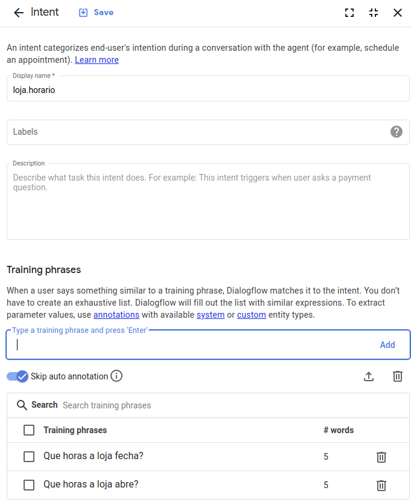

12. Clique em **Save**. A nova página aparece no gráfico porque há uma transição que leva a ela.
13. Feche o painel de edição da rota de intent.
14. Clique em **Horário da Loja**, depois em **Edit Fulfillment**
15. Adicione como fullfilment` A loja abre de segunda a sábado, das 9 da manhã as 7 da noite e não abre aos sábados.`, depois clique em **Save**

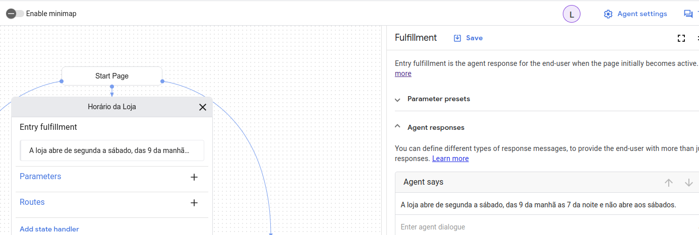

16. Feche todos os painéis de edição.

### Testar a página do horário da loja

Para testar a página do local da loja, faça o seguinte:

5. Clique no botão **Test agent **para abrir o simulador.
6. Digite `Qual o horário de funcionamento da loja?` e pressione "Enter".
7. O agente fornecerá o horário de funcionamento

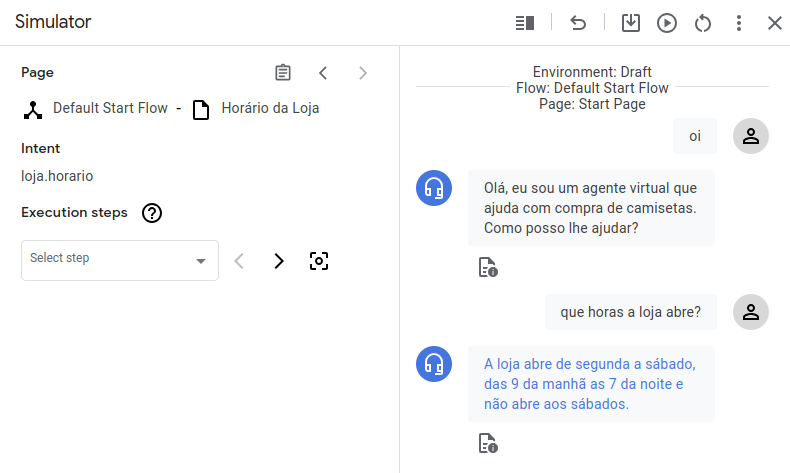

8. Feche o simulador.

## Página de itens do pedido

Em seguida, você cria uma página que usa [parâmetros de formulário](https://cloud.google.com/dialogflow/cx/docs/concept/parameter?hl=pt-br#form). Quando o usuário final solicitar um novo pedido de camisa, a sessão passa para essa página. Quando ativa, essa página coleta um tamanho e uma cor para o pedido de camisa.

### Criar um tipo de entidade personalizado para o tamanho da camisa

Os [tipos de entidade](https://cloud.google.com/dialogflow/cx/docs/concept/entity?hl=pt-br) são usados para controlar como os dados da entrada do usuário final são extraídos. O Dialogflow fornece entidades predefinidas do sistema que podem corresponder a muitos tipos comuns de dados. Por exemplo, há entidades do sistema que correspondem a datas, horários, cores, endereços de e-mail e assim por diante. Também é possível criar entidades personalizadas para corresponder a dados específicos.

Para esse agente, é possível usar uma entidade do sistema para a cor da camisa, mas você precisa criar uma entidade personalizada para o tamanho da camisa. O tipo de entidade de tamanho precisa ter as seguintes entradas de entidade:

<table>
  <tr>
   <td>Entidade
   </td>
   <td>Sinônimos
   </td>
  </tr>
  <tr>
   <td>pequeno
   </td>
   <td>pequeno, muito pequeno, extra pequeno
   </td>
  </tr>
  <tr>
   <td>média
   </td>
   <td>médio, tamanho único, comum
   </td>
  </tr>
  <tr>
   <td>grande
   </td>
   <td>grande, muito grande, extra grande
   </td>
  </tr>
</table>

Para criar essa entidade, siga estas etapas:

1. Selecione a guia **Manage**.
2. Clique em **Entity types**.
3. Clique em **+ Create**.
4. Defina o nome de exibição como `tamanho`.
5. Adicione as entradas de entidade listadas na tabela acima.

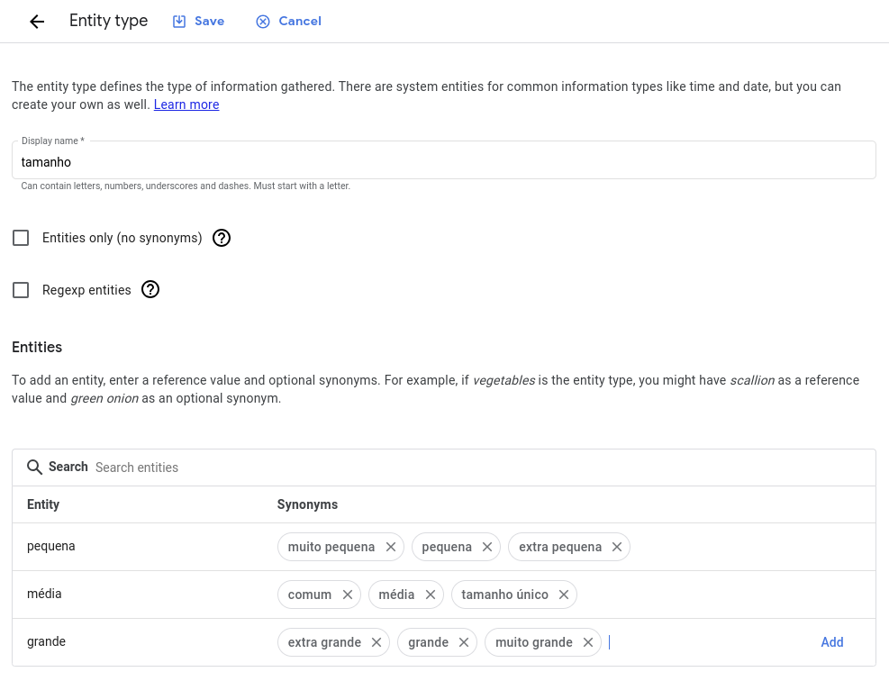

6. Clique em **Save**.

### Criar um intent de pedido com parâmetros de intent

Você precisa de uma intent que corresponda à solicitação de um novo pedido de camisa do usuário final. Essa intent também deve capturar opcionalmente a cor e/ou o tamanho da camisa fornecidos pelo usuário final, caso ele forneça essa informação antecipadamente.

[Parâmetros](https://cloud.google.com/dialogflow/cx/docs/concept/parameter?hl=pt-br) são usados para capturar e referir-se a valores fornecidos pelo usuário final durante uma sessão. Cada parâmetro tem um nome de exibição e um tipo de entidade. Ao contrário da entrada bruta do usuário final, os parâmetros são dados estruturados que podem ser facilmente usados para executar uma lógica ou gerar respostas.

Controle como os dados do usuário final são extraídos com a correspondência de intent [anotando](https://cloud.google.com/dialogflow/cx/docs/concept/intent?hl=pt-br#annot) partes das frases de treinamento e configurando os [parâmetros de intent](https://cloud.google.com/dialogflow/cx/docs/concept/parameter?hl=pt-br#intent) associados. Por exemplo, considere uma frase de treinamento como "Qual é a previsão amanhã para Tóquio?" Anote "amanhã" com um parâmetro `date` e "Tóquio" com um parâmetro `location`. Quando você anota partes de uma frase de treinamento, o Dialogflow reconhece que essas partes são apenas exemplos de valores reais que serão fornecidos pelos usuários finais no ambiente de execução. Para uma entrada de usuário final, como "Qual é a previsão para São Paulo na sexta-feira?", o Dialogflow extrairia o parâmetro `date` de "Sexta-feira" e o parâmetro `location` de "São Paulo".

Para anotar uma frase de treinamento com o console:

1. Selecione a parte da frase de treinamento que você quer anotar.
2. Selecione o tipo de entidade desejado na lista.
3. Um parâmetro é criado para você na tabela de parâmetros abaixo.

Crie uma intent semelhante às etapas seguidas acima. Nomeie esse intent como `pedido.novo`. Para cada frase que contém uma cor, anote a cor com um parâmetro `color` e o tipo de entidade do sistema `@sys.color`. Para cada frase que conté, um tamanho de camisa, anote o tamanho com um parâmetro `size` e o tipo de entidade personalizada `@size` criado nas etapas anteriores. As frases e os parâmetros de treinamento precisam ser semelhantes a estes:

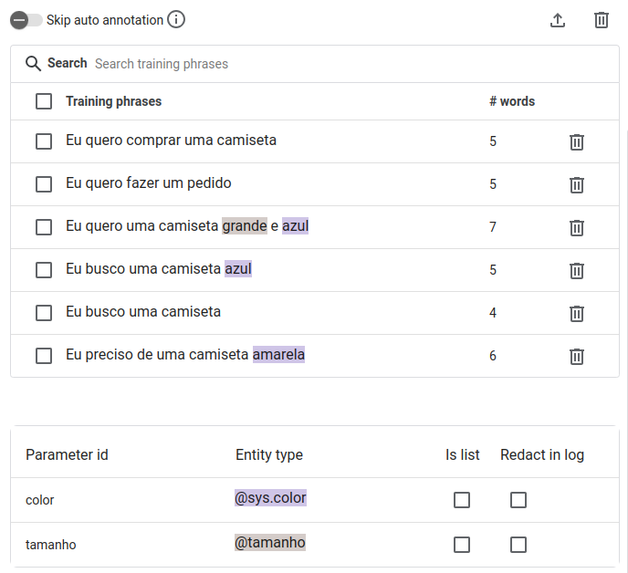

### Criar uma página de pedidos

Crie a nova página de pedidos seguindo as etapas semelhantes às anteriores:

* Nome de exibição: `Novo Pedido`
* Fulfillment de entrada: `Ok, vamos começar um novo pedido para você.`

### Adicionar um formulário à página do pedido

Para cada página, é possível definir um [formulário](https://cloud.google.com/dialogflow/cx/docs/concept/parameter?hl=pt-br#form), que é uma lista de parâmetros que precisam ser coletados do usuário final para a página. O agente interage com o usuário final em várias rodadas de conversas até que ele tenha coletado todos os _parâmetros de formulário_ obrigatórios, também conhecidos como _parâmetros de página_. Para cada parâmetro de formulário, você também fornece _prompts_ que o agente usa para solicitar essas informações do usuário final. Esse processo é chamado de _preenchimento de formulário_.

Quando um usuário final fornece parâmetros de intent para uma correspondência de intent, os parâmetros de intent se tornam [parâmetros de sessão](https://cloud.google.com/dialogflow/cx/docs/concept/parameter?hl=pt-br#session). Quando uma página fica ativa, todos os parâmetros do formulário são preenchidos previamente com quaisquer parâmetros de sessão com nome semelhante. Portanto, se o usuário final fornecer o tamanho ou a cor quando a intent **pedido.novo** for correspondida, esses valores serão preenchidos automaticamente no formulário.

Para a página do novo pedido, você precisa definir dois parâmetros de formulário obrigatórios:

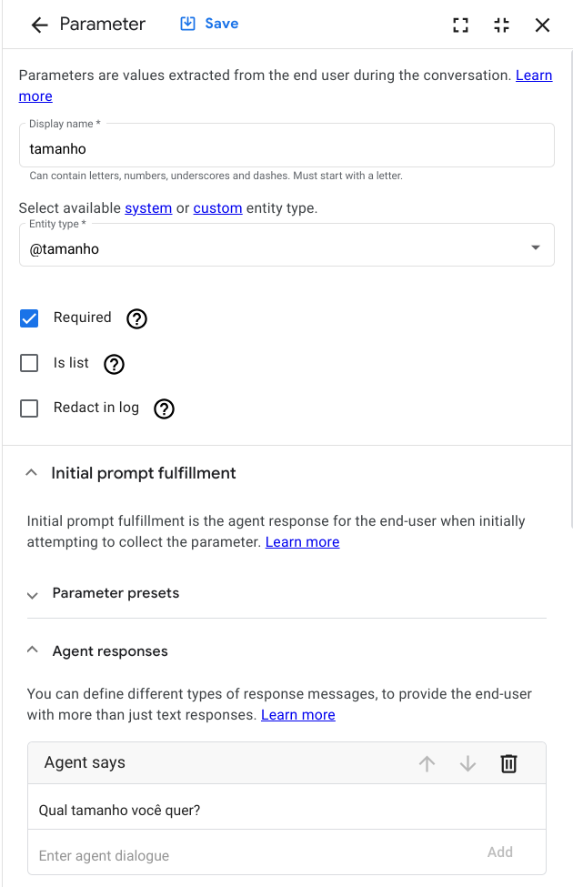

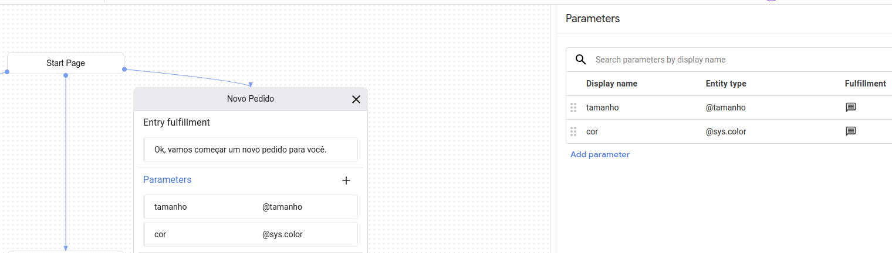

### Adicionar uma rota de intent de pedido ao fluxo

Semelhante às etapas anteriores acima, adicione uma rota ao **Default start flow**. Essa rota deve ser chamada quando o usuário final quiser fazer um novo pedido:

* Intent: **pedido.novo**
* Página de destino da transição: **Novo pedido**

## Página de confirmação

A página final confirmará apenas o pedido e terminará a sessão.

### Criar a página de confirmação

Crie uma página de confirmação com uma resposta que usa os parâmetros de sessão para confirmar a ordem:

* Nome de exibição: `Confirmação de Pedido`
* Fulfillment de entrada: `Você pode vir buscar o seu pedido de uma camiseta tamanho $session.params.tamanho e da cor $session.params.cor daqui a 7 a 10 dias úteis. Muito obrigado pelo pedido!`

### Adicionar rotas de condição à página de pedido

Também é possível usar [condições](https://cloud.google.com/dialogflow/cx/docs/reference/condition?hl=pt-br) para determinar se uma rota é chamada. Geralmente, as condições são usadas para verificar se um formulário foi preenchido ou se estão configuradas para serem chamadas sempre que forem avaliadas.

Para definir condições no console CX, consulte a documentação [Definir condições](https://cloud.google.com/dialogflow/cx/docs/concept/handler?hl=pt-br#cond).

Adicione a rota a seguir à página de pedidos, que será chamada quando o formulário da página de pedido for preenchido. Observe como essa rota de condição usa referências de parâmetro na resposta ao usuário final e como ela passa a sessão para a página de **Confirmação de pedido**.

* **Condição**: `$page.params.status = "FINAL"`
* **Fala do agente**: `Você selecionou o tamanho $session.params.tamanho e a cor $session.params.cor para sua camiseta.`
* **Página de transição**: `Confirmação de Pedido`

Adicione a seguinte rota à página de pedidos, que será chamada para cada fala na conversa em que a página for ativa e a rota de condição for avaliada. Quando a condição acima for avaliada e chamada, a página ficará inativa. Portanto, essa rota de condição _true_ não será avaliada:

* **Condição**: `true`
* **Fala do agente**: `Eu gostaria de coletar só mais algumas informações.`

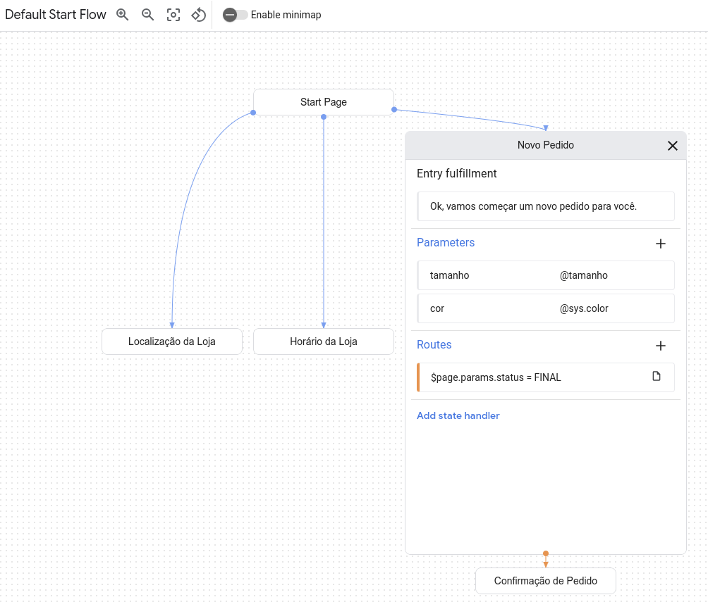

### Criar uma rota de condição para finalizar a sessão.

Adicione a seguinte rota de condição à página **Confirmar pedido** para encerrar a sessão assim que a página se tornar ativa e o fulfillment de entrada for processado:

* **Condição**: `true`
* **Destino da transição**: **Page**: `End Session`

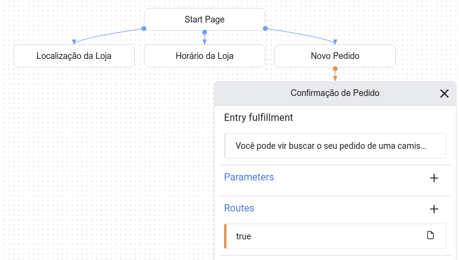

### Testar o agente concluído

Teste o agente com a seguinte caixa de diálogo:

<table>
  <tr>
   <td>Diálogo
   </td>
   <td>Explicação
   </td>
  </tr>
  <tr>
   <td>Usuário final: Olá

Agente: Olá, este é um agente virtual de pedidos. Como posso ajudá-lo?
   </td>
   <td>
<ol>

<li>A rota Default Welcome Intent no fluxo inicial padrão é chamada.

<li>O fulfillment desse manipulador de estado ("Olá, este é um...") foi adicionado à fila de respostas.

<li>O agente envia a fila de resposta para o usuário final.
</li>
</ol>
   </td>
  </tr>
  <tr>
   <td>Usuário final: quero comprar uma camisa azul

Agente: Ok, vamos começar um novo pedido.

Agente: gostaria de coletar mais informações suas.

Agente: qual é o tamanho desejado?
   </td>
   <td>
<ol>

<li>A rota de intent order.new no fluxo inicial padrão é avaliada.

<li>A intent order.new é combinada, e o parâmetro de intent color é definido como "blue".

<li>A sessão é transferida para a página New Order, e o parâmetro de intent color se torna um parâmetro de sessão.

<li>A página Novo pedido tem um preenchimento de entrada ("Ok, vamos começar...") que será adicionado à fila de resposta.

<li>O parâmetro de sessão color é usado para preencher o parâmetro de formulário com nome semelhante.

<li>A rota de condição verdadeira na página Novo pedido é avaliada e chamada. Ela contém uma mensagem de resposta ("Eu gostaria de coletar...") que será adicionada à fila de resposta.

<li>O formulário das páginas não foi preenchido. Portanto, o agente usa o prompt de tamanho ("Qual tamanho...") e o adiciona à fila de resposta.

<li>O agente envia a fila de resposta para o usuário final.
</li>
</ol>
   </td>
  </tr>
  <tr>
   <td>Usuário final: grande

Agente: você selecionou uma camisa grande azul.

Agente: você receberá o pedido de uma camisa azul grande de 7 a 10 dias úteis. Goodbye.
   </td>
   <td>
<ol>

<li>A entrada do usuário final preenche o parâmetro size solicitado pelo agente na volta da conversa anterior.

<li>A rota de preenchimento do formulário na página Novo pedido é avaliada e chamada. Ela tem um fulfillment ("Você selecionou...") adicionado à fila de respostas e com as referências de parâmetros resolvidas para valores reais fornecidos pelo usuário final.

<li>A sessão é transferida para a página Confirmação do Pedido.

<li>A página Confirmação do pedido tem um fulfillment de entrada ("Você pode retirar..."), que é adicionado à fila de resposta.

<li>O agente envia a fila de resposta para o usuário final.

<li>A sessão é transferida para Finalizar sessão.
</li>
</ol>
   </td>
  </tr>
</table>

## Produção

Antes de executar seu agente na produção, implemente as [práticas recomendadas de produção](https://cloud.google.com/dialogflow/cx/docs/concept/best-practices?hl=pt-br#prod).
